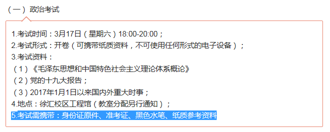
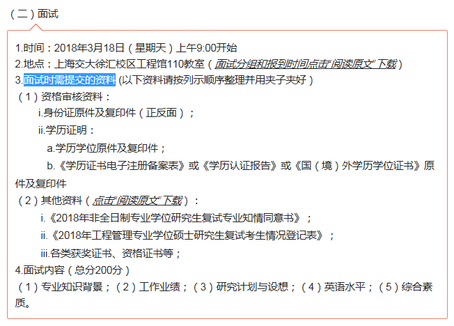

根据群里的资料收集:

# 政治考试资料
* 《毛泽东思想和中国特色社会主义理论体系概论》（2015年修订版），高等教育出版社，2015年8月版；
*  [党的十九大报告](19大报告全文.docx) (补充：[19大思维导图高清版本](19大思维导图高清版本.pdf))
*  [2017年1月1日以来国内外重大时事](2017-2018.3.5时政热点.pdf)

# 复试准备资料
* 
* 

# 复试相关
* [2018年工程管理专业学位硕士研究生复试名单](2018年工程管理专业学位硕士研究生复试名单.pdf)
* [2018年工程管理硕士面试分组及报到时间安排](2018年工程管理硕士面试分组及报到时间安排.pdf)
* [2018年非全日制专业学位研究生复试考生知情同意书](2018年非全日制专业学位研究生复试考生知情同意书.docx)
* [2018年工程管理专业学位硕士研究生复试考生情况登记表](2018年工程管理专业学位硕士研究生复试考生情况登记表.docx)
